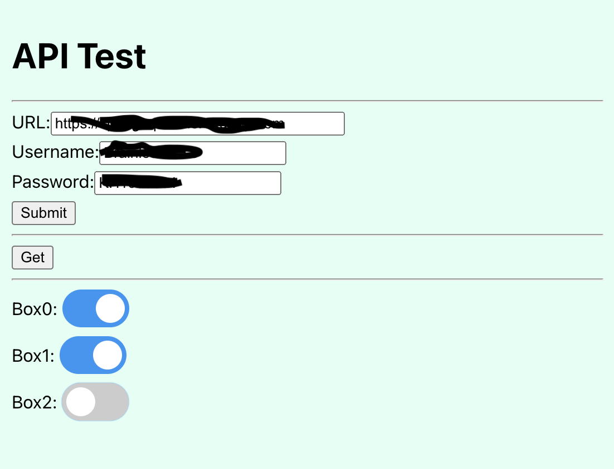

# Web UI based on React (PWA)



https://araobp.github.io/react-api/build/

## Set up

Enter Heroku app's URL of [spring-api](https://github.com/araobp/spring-api) and its username and password.

Config Vars of the Heroku app,
```
BOX_USERNAME: <HTTP basic auth username>
BOX_PASSWORD: <HTTP basic auth password>
```
